#  CrewIntel: Agentic Market Research Bot

Welcome to the CrewIntel: Agentic Market Research Bot project, powered by [crewAI](https://crewai.com). It simulates a virtual team of domain-specific agents—such as Researchers, Analysts, and Reporters—that collaborate to extract valuable insights from public data sources with minimal human intervention.
This project demonstrates the power of Agentic AI workflows by leveraging LLMs and role-based agent behaviors to automate complex research tasks traditionally handled by human analysts.

## System Architecture

## 🔍Key Features
- Multi-Agent Collaboration: Implements a team of specialized agents with clear roles (e.g., Researcher, Analyst, Reporter) that communicate and reason collectively.
- Autonomous Intelligence Gathering: Uses tools like web search, scraping, and document retrievers to collect relevant company data from public sources.
- Insight Synthesis: Translates raw data into structured summaries and reports tailored for decision-makers or competitive analysis.
- Modular Agent Design: Built with CrewAI and LangChain, allowing easy customization and extension of agent roles, tools, and memory.

## 🛠️ Tech Stack
- CrewAI – For agent orchestration and workflow management
- LangChain – Tool/agent integration and RAG setup
- OpenAI / Groq / Gemini LLMs – Language reasoning and summarization
- SerpAPI / Tavily / Web search tools – Real-time data sourcing
- Python – Core development language

## 💼 Use Cases
- Competitive Intelligence
- Company & Market Research
- Automated Brief Generation
- VC/Startup Screening Support
- Business Development Insight Engine